## ScenarioView
1. UseCase — Scenario View: Use Case Diagram
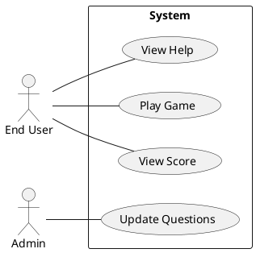

## LogicView
2. Class — Logic View: Class Diagram
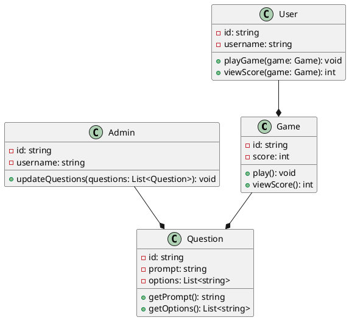
3. Object — Logic View: Object Diagram
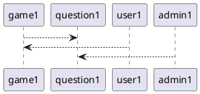
4. State — Logic View: State Diagram
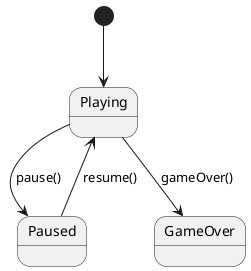

## ProcessView
5. Activity — Process View: Activity Diagram
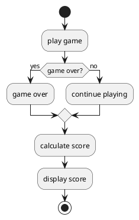
6. Sequence — Process View: Sequence Diagram 
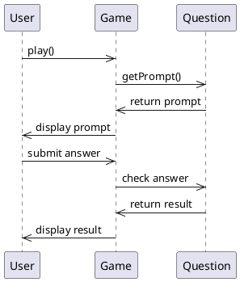
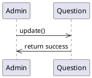
7. Collaboration — Process View: Collaboration Diagram
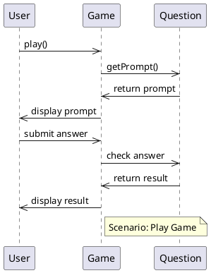
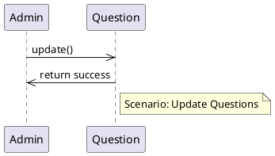

## DevelopmentView
8. Package — Development View: Package Diagram
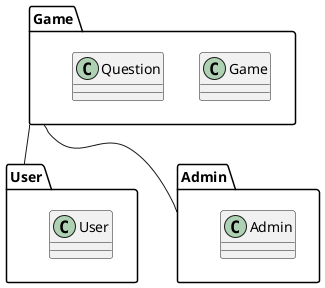
9. Component — Development View: Component Diagram
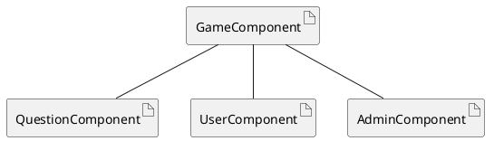

## PhysicalView
10. Deployment — Physical View: Deployment Diagram
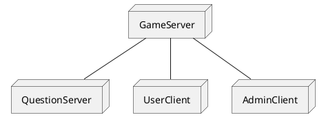
11. Container — Physical View: Container Diagram
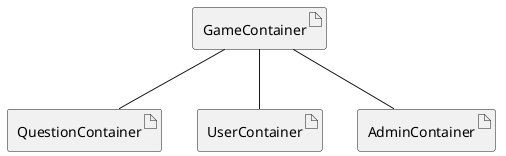